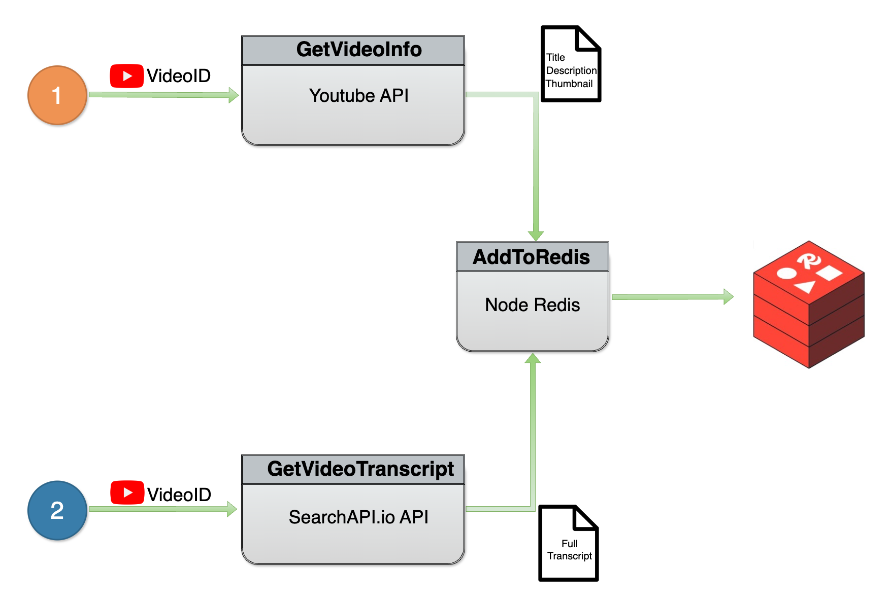

## Links

- [current repo](https://github.com/PrasanKumar93/redis-short-demos/tree/main/youtube-video-qa-demo)

- [Original Tutorial](https://redis.io/learn/howtos/solutions/vector/ai-qa-videos-langchain-redis-openai-google)
- [Original Demo APP](https://github.com/redis-developer/video-qa-semantic-vector-caching)

## Add following environment variables to `.env` file

```yml
REDIS_URL=redis://localhost:6379
PORT=8000

SEARCHAPI_API_KEY=
GOOGLE_API_KEY=
OPENAI_API_KEY=
OPENAI_ORGANIZATION=

YOUTUBE_VIDEOS="AJhTduDOVCs,I-ohlZXXaxs,SzcpwtLRgyk,Z8qcpXyMAiA"
```

- Create [openai api key](https://platform.openai.com/api-keys) and add it to `OPENAI_API_KEY`
- Add [openai organization id](https://platform.openai.com/settings/organization/general) to `OPENAI_ORGANIZATION`

- Add any youtube video id to `YOUTUBE_VIDEOS` separated by comma

- Create [search api key](https://www.searchapi.io/) and add it to `SEARCHAPI_API_KEY`
- Create [google api key](https://console.cloud.google.com/) and add it to `GOOGLE_API_KEY`, also enable [YouTube Data API v3](https://console.cloud.google.com/apis/library/youtube.googleapis.com)

Note:

- Learn more about [YouTube Data API v3](https://developers.google.com/youtube/v3/getting-started)
- If you don't want to create search api key and google api key, you can use the following commands to seed existing data

```sh

```

## Run the following commands

```sh
# to get video info
npm run 01

# to get video transcript
npm run 02
#-------------------------

# to summarize transcript
npm run 03

# to store summary vectors
npm run 04

# to search summary
npm run 05

# to search summary with semantic cache
npm run 06
```

## Flow diagrams

### Video info and transcript (Pre-requisite)



### Database setup : Generating summary and summary vector


### Search summary


### Search summary with semantic cache


